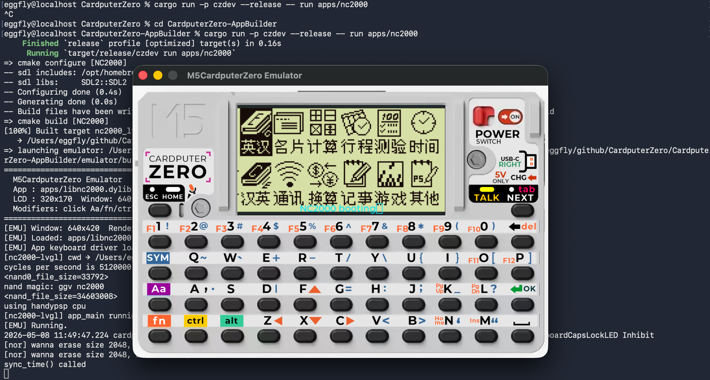
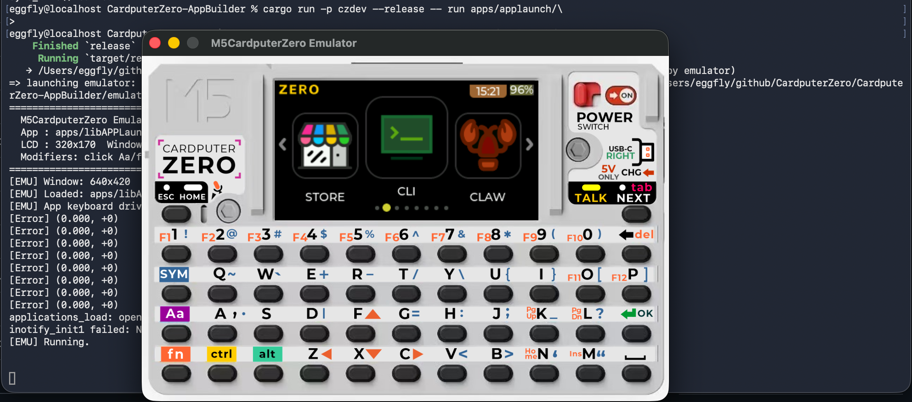
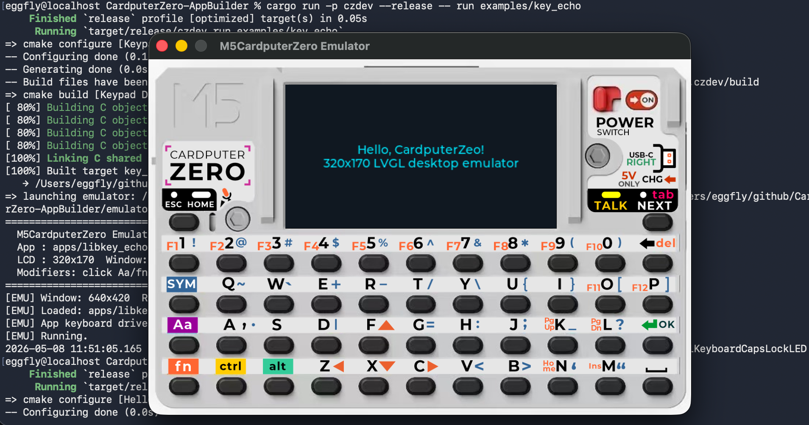

# CardputerZero AppBuilder

Online build system & desktop development toolkit for [M5CardputerZero](https://docs.m5stack.com/) applications. Submit any public Git repository and get a ready-to-install `.deb` package — no local toolchain required. Or develop locally with the built-in emulator.

## Desktop Emulator

The `czdev` CLI includes a desktop emulator that renders the CardputerZero 320x170 LCD inside a keyboard skin. Develop and test apps without a physical device.

### NC2000 (文曲星 PDA Emulator)

```bash
cargo run -p czdev --release -- run apps/nc2000
```



### APPLauncher (Home Screen)

```bash
cargo run -p czdev --release -- run apps/applaunch/
```



### Hello CardputerZero (Example App)

```bash
cargo run -p czdev --release -- run examples/key_echo
```



## Quickstart — Desktop Dev

[中文](docs/QUICKSTART_ZH.md) | [日本語](docs/QUICKSTART_JA.md)

Get a 320x170 LVGL app running on your Mac or Linux machine in ~3 minutes — no CardputerZero device required.

### 1. Prerequisites

**macOS:**
```bash
brew install cmake pkg-config sdl2 sdl2_image sdl2_mixer freetype
```

**Linux (Debian/Ubuntu):**
```bash
sudo apt install -y build-essential cmake pkg-config \
    libsdl2-dev libsdl2-image-dev libsdl2-mixer-dev libfreetype-dev
```

**Windows:** MSYS2 MINGW64 shell. See [DESKTOP_DEV.md §4](docs/DESKTOP_DEV.md#4-windows-lvgl--emulator--known-issues-and-plan) for Windows-specific notes.

You also need a recent Rust toolchain (for `czdev`):
```bash
curl --proto '=https' --tlsv1.2 -sSf https://sh.rustup.rs | sh
```

### 2. Clone with submodules

```bash
git clone --recursive git@github.com:m5stack/CardputerZero-AppBuilder.git
cd CardputerZero-AppBuilder
```

If you already cloned without `--recursive`:
```bash
git submodule update --init --recursive
```

### 3. Verify the environment

```bash
cargo run -p czdev --release -- doctor
```

All required rows should be green. If anything is MISSING, the output shows the exact install command for your OS.

### 4. Run the hello app

```bash
cargo run -p czdev --release -- run examples/hello_cz
```

On first run this will:
1. Build the emulator (once, cached in `emulator/build/`).
2. Build the app into `.czdev/build/`.
3. Stage the resulting shared library into the emulator's `apps/` directory.
4. Launch the emulator with the app loaded via `dlopen`.

### 5. Edit-run loop

```bash
cargo run -p czdev --release -- watch examples/hello_cz
```

The watcher polls `src/`, `include/`, `assets/`, `CMakeLists.txt` and `app-builder.json`. Any change triggers a rebuild and relaunches the emulator.

### 6. Writing your own app

Copy `examples/hello_cz/` and edit `src/hello_cz.c`. The ABI:

```c
#include <cz_app.h>

void app_main(lv_obj_t *parent) {
    lv_obj_t *label = lv_label_create(parent);
    lv_label_set_text(label, "your UI here");
    lv_obj_center(label);
}

void app_event(int type, void *data) {
    (void)type; (void)data;
}
```

The `CMakeLists.txt`:

```cmake
cmake_minimum_required(VERSION 3.16)
list(APPEND CMAKE_MODULE_PATH "${CMAKE_CURRENT_LIST_DIR}/../../sdk/cmake")
include(CZApp)
cz_add_lvgl_app(my_app SOURCES src/my_app.c)
```

And the manifest (`app-builder.json`, see [docs/APP_BUILDER_JSON.md](docs/APP_BUILDER_JSON.md)):

```json
{
  "package_name": "my_app",
  "bin_name": "my_app",
  "app_name": "My App",
  "runtime": "lvgl-dlopen",
  "lvgl_version": "9.5"
}
```

### 7. Shipping to a real device

Build the aarch64 `.deb` via CI (trigger the `build-deb.yml` workflow), then deploy:

```bash
cargo run -p czdev --release -- deploy \
    --host pi@192.168.50.150 \
    --deb path/to/my_app_arm64.deb
```

### 8. Publishing to the AppStore

```bash
# Login to GitHub (one-time)
./target/release/czdev login

# Check next version
./target/release/czdev bump --deb build/my_app_1.0.0_arm64.deb

# Publish (version in deb must be newer than existing)
./target/release/czdev publish --deb build/my_app_1.0.1_arm64.deb

# Remove your own package
./target/release/czdev unpublish my_app --version 1.0.1
```

#### Publish Workflow

```
┌──────────────────────────────────────────────────────────────────────────────┐
│                    czdev publish — End-to-End Flow                            │
└──────────────────────────────────────────────────────────────────────────────┘

 ┌─────────┐         ┌─────────┐         ┌──────────┐         ┌─────────────┐
 │  LOGIN  │────────▶│  BUILD  │────────▶│  PUBLISH │────────▶│   REVIEW    │
 └─────────┘         └─────────┘         └──────────┘         └─────────────┘
      │                    │                    │                      │
      ▼                    ▼                    ▼                      ▼
 czdev login          czdev build         czdev publish           Admin merges
 (GitHub OAuth        or CI workflow       --deb xxx.deb           the PR
  Device Flow)        ─▶ .deb artifact    ┌────────────┐          │
      │                                   │ Preflight: │          ▼
      ▼                                   │ • .desktop │    ┌───────────┐
 Token saved                              │ • email ✓  │    │  RELEASE  │
 ~/.config/                               │ • version ✓│    └───────────┘
 czdev/token                              │ • size ✓   │          │
                                          └─────┬──────┘          ▼
                                                │           APT repo updated
                                                ▼           App live in Store
                                          Fork + Push
                                          ─▶ PR created
                                             on packages

─ ─ ─ ─ ─ ─ ─ ─ ─ ─ ─ ─ ─ ─ ─ ─ ─ ─ ─ ─ ─ ─ ─ ─ ─ ─ ─ ─ ─ ─ ─ ─ ─ ─ ─ ─

 Timeline:

 You (Developer)                  czdev                     GitHub (Remote)
 ───────────────                  ─────                     ───────────────
      │                             │                             │
      │── czdev login ─────────────▶│── OAuth Device Flow ──────▶│
      │                             │◀── access token ───────────│
      │                             │                             │
      │── czdev publish ───────────▶│                             │
      │                             │── validate .deb ──────────▶│ (check ver)
      │                             │── fork packages repo ─────▶│
      │                             │── git push (LFS) ─────────▶│
      │                             │── POST /pulls ────────────▶│
      │◀── PR URL ─────────────────│                             │
      │                             │                             │
      │                             │              Admin reviews & merges
      │                             │                             │
      │                             │              CI rebuilds APT index
      │                             │                             │
      │◀───────────────────── App available in AppStore ─────────│
      │                                                           │
```

## Install czdev

**Option A — Build from source (recommended):**

```bash
git clone --recursive git@github.com:m5stack/CardputerZero-AppBuilder.git
cd CardputerZero-AppBuilder
cargo build --release -p czdev
# Binary at: target/release/czdev
```

Then use directly: `./target/release/czdev <command>`

**Option B — Download prebuilt binary:**

Download from [Releases](https://github.com/m5stack/CardputerZero-AppBuilder/releases) for your platform (macOS/Linux/Windows).

## CI Online Build

1. Go to **Actions** > **Build DEB Package** > **Run workflow**
2. Fill in the form:

   | Field | Required | Example | Description |
   |-------|----------|---------|-------------|
   | **Repository URL** | Yes | `https://github.com/eggfly/M5CardputerZero-UserDemo.git` | Any public HTTP Git URL (GitHub, GitCode, Gitee, etc.) |
   | **Branch** | No | `master` | Leave empty to use the repository's default branch |

3. The system automatically scans for `app-builder.json` files in the repo, builds each project, and packages them as `.deb`
4. Download the `.deb` from the workflow run's **Artifacts** section

### Install on Device

```bash
scp <package>_arm64.deb pi@<device-ip>:/tmp/
ssh pi@<device-ip> "sudo dpkg -i /tmp/<package>_arm64.deb"
```

## Architecture

The CI pipeline runs on x86_64 and **cross-compiles** to ARM64 (aarch64) using the `aarch64-linux-gnu-` toolchain — the same approach used by the [M5Stack_Linux_Libs](https://github.com/m5stack/M5Stack_Linux_Libs) SDK.

```
User Input (repo URL)
        │
        ▼
  ┌──────────────┐     ┌──────────────┐     ┌──────────────┐     ┌──────────────┐
  │  git clone   │────▶│   discover   │────▶│ scons build  │────▶│  dpkg-deb    │
  │  --recursive │     │ app-builder  │     │ (x86→arm64)  │     │  packaging   │
  └──────────────┘     │    .json     │     └──────────────┘     └──────────────┘
                       └──────────────┘              │
                              │                      ▼
                        N projects          N × .deb artifacts
                        (parallel)            (download)
```

## DEB Package Structure

Generated packages follow the [APPLaunch packaging conventions](https://github.com/dianjixz/M5CardputerZero-UserDemo/blob/main/doc/APPLaunch-App-%E6%89%93%E5%8C%85%E6%8C%87%E5%8D%97.md):

```
<package>.deb
├── DEBIAN/
│   ├── control
│   ├── postinst      (enable & start systemd service)
│   └── prerm         (stop & disable service)
├── lib/systemd/system/
│   └── <package>.service
└── usr/share/APPLaunch/
    ├── applications/<package>.desktop
    ├── bin/<executable>
    ├── lib/
    └── share/
        ├── font/*.ttf
        └── images/*.png
```

## Troubleshooting

- **`emulator submodule not checked out`** — you forgot `--recursive`. Fix: `git submodule update --init --recursive`.
- **LVGL link errors about unresolved symbols** — expected in the app library; resolved at `dlopen` time by the emulator.
- **`indev_read_cb is not registered` warnings** — benign; the emulator falls back to a default keypad indev.
- **macOS: `Library not loaded: @rpath/SDL2.framework/...`** — re-run `czdev doctor` and install what it reports.

## Related Projects

- [M5CardputerZero-UserDemo](https://github.com/dianjixz/M5CardputerZero-UserDemo) — Reference user demo application
- [M5Stack_Linux_Libs](https://github.com/m5stack/M5Stack_Linux_Libs) — SDK with SCons build system
- [m5stack-linux-dtoverlays](https://github.com/m5stack/m5stack-linux-dtoverlays) — Device tree overlays & drivers

## License

MIT
